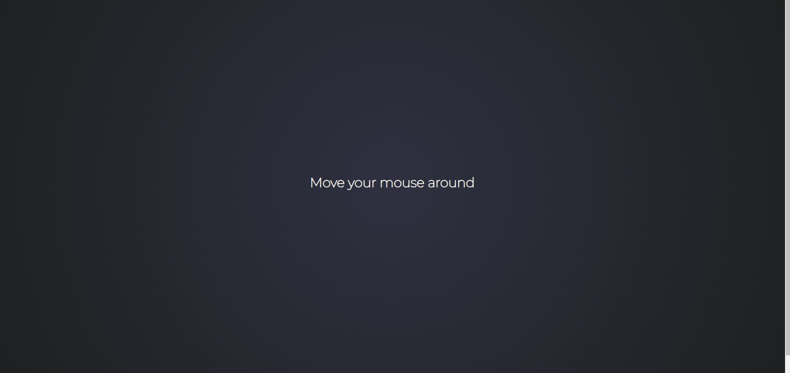

# Interactive Stars Animation on Mouse Hover

## Description
This project creates an interactive stars animation effect that follows the user's mouse movements. The background features a gradient effect, and the stars dynamically change size and color as they appear and fade out. Additionally, a custom cursor icon is displayed as the mouse moves across the screen.

## Features
- **Dynamic Stars:** Stars appear at the mouse pointer's location and gradually fade away.
- **Responsive Design:** The animation and layout are designed to work on different screen sizes.

[//]: # (## Installation)

[//]: # (1. Clone the repository:)

[//]: # (   ```bash)

[//]: # (   git clone <repository-url>)

[//]: # (    ```)
   



